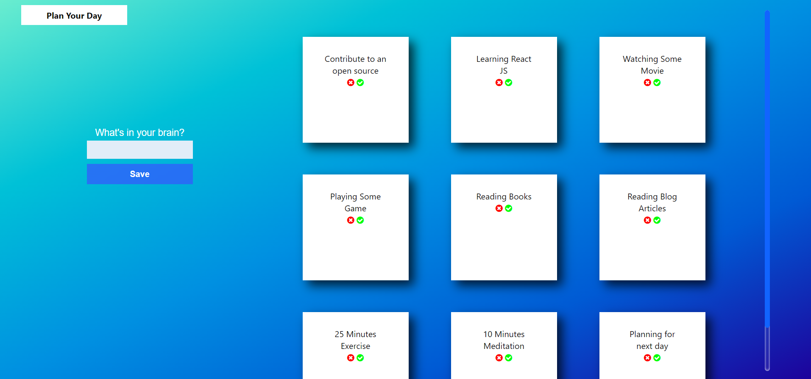
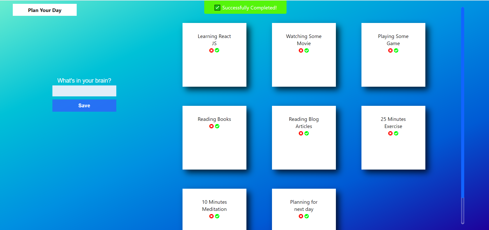
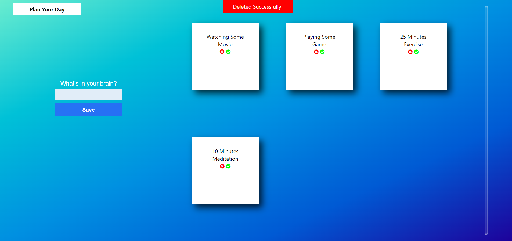
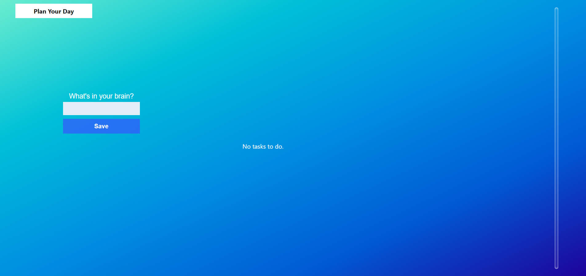

# Plan Your Day - React App
React application that helps you plan your day and makes you productive.
With this, we will learning how to use __Local Storage__ in React.

# 🏗 Built with
- React.js

### 🍔 Things Used
- ♟ useState 
- ♟ useEffect
- ♟ local storage
- ♟ react-notify-toast

## 🏗 Setup 
1. Fork the repo by clicking the fork button
2. Clone the repo
```
    $ git clone https://github.com/your_github_username/PlanYourDay.git
```
3. change to project directory
```
    $ cd PlanYourDay
```
4. you need to install node_modules
```
    $ npm install
```
It's time to run the project
```
    $ npm start
```

# 📷 Screenshots
<br/>
<br/>
<br/>
<br/>


